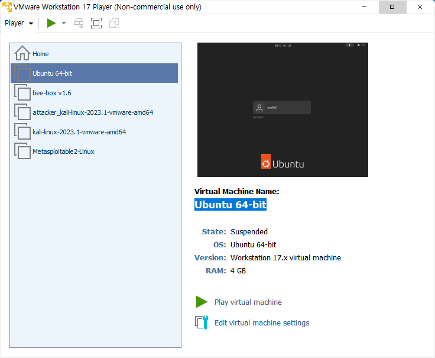

# 도커를 이용한 프로젝트 배포

상태: 배포됨
생성 일시: 2023년 5월 23일 오후 7:34
작성자: 박건우
최하위 정렬: No

# **Docker에 대한 이해**

## **개요**

Docker는 2013년에 처음 발표된 오픈소스 컨테이너 플랫폼으로, 어플리케이션과 그 의존성을 하나의 실행 가능한 패키지로 묶는데 사용됩니다. 이 패키지는 "컨테이너"라고 불리며, 컨테이너를 통해 개발, 테스트, 배포 환경 간에 일관성을 유지할 수 있습니다.

## **Docker 구조**

Docker의 주요 구성 요소는 Docker 엔진, 이미지, 컨테이너 및 Docker Hub입니다.

- **Docker Engine**: Docker는 클라이언트-서버 형태의 구조로 동작합니다. Docker Engine은 클라이언트와 서버 모두를 포함합니다.
- **이미지**: Docker 이미지는 어플리케이션 및 실행 환경을 패키징한 것으로, 이미지를 기반으로 컨테이너를 생성합니다. 이미지는 Dockerfile이라는 텍스트 파일에 정의되며, 이 파일에는 어플리케이션을 실행하는데 필요한 모든 명령어가 포함됩니다.
- **컨테이너**: 컨테이너는 Docker 이미지의 실행 인스턴스입니다. 컨테이너는 이미지를 바탕으로 생성되며, 독립적인 실행 환경을 제공합니다.
- **Docker Hub**: Docker Hub는 Docker 이미지를 공유하기 위한 중앙화된 리소스 저장소입니다. Docker Hub를 사용하면 이미지를 공개적으로 공유하거나 비공개로 유지할 수 있습니다.

## **Docker의 장점**

Docker는 다음과 같은 주요 장점을 제공합니다.

- **효율성**: Docker는 가상 머신과 비교했을 때 훨씬 적은 오버헤드와 더 빠른 시작 시간을 제공합니다.
- **이식성**: Docker 컨테이너는 어느 환경에서나 동일하게 동작합니다.
- **버전 관리 및 구성 관리**: Docker는 이미지에 대한 버전 관리를 제공하며, 코드와 함께 응용 프로그램의 구성을 저장하고 관리할 수 있습니다.
- **개발과 운영 간의 일관성**: Docker를 사용하면 개발, 테스트, 프로덕션 환경 간에 일관성을 유지할 수 있습니다.

## **Docker의 단점**

- **성능**: Docker는 호스트 OS와 공유하는 커널을 사용하므로, 일부 사용 사례에서는 가상 머신보다 성능이 떨어질 수 있습니다.
- **복잡성**: Docker의 사용과 관리는 복잡할 수 있으며, 학습 곡선이 있습니다.
- **보안**: Docker 컨테이너는 호스트 시스템과 공유하는 커널을 사용하기 때문에, 컨테이너가 보안 취약점을 가질 경우 시스템 전체에 영향을 줄 수 있습니다.

## **Docker 추가 기능**

- **볼륨**: Docker 볼륨은 데이터를 컨테이너 외부에 저장하여 데이터를 영구적으로 유지하거나 여러 컨테이너 간에 공유할 수 있도록 합니다.
- **네트워킹**: Docker는 컨테이너 간의 네트워크 통신을 지원합니다. Docker 네트워킹은 여러 컨테이너 간의 통신, 컨테이너와 호스트 간의 통신, 그리고 외부 네트워크와의 통신을 가능하게 합니다.
- **지속적인 통합/지속적인 배포 (CI/CD)**: Docker는 Jenkins, GitLab CI 등의 CI/CD 툴과 통합하여, 코드의 통합, 테스트, 배포를 자동화하는데 사용됩니다.

## **결론**

Docker는 신속하게 변화하는 소프트웨어 개발 및 배포 환경에서 중요한 도구로 자리 잡았습니다. 이에 대한 깊은 이해는 개발자, 시스템 관리자, DevOps 엔지니어 등 IT 전문가에게 큰 도움이 될 것입니다.

## 프로젝트

### 개발환경

---

- **VMware - Ubuntu**



### 도커 환경 구축

---

- **우분투에 설치 가능한 패키지 버전과 정보 업데이트**
    
    ```bash
    sudo apt-get update
    ```
    
    
    
- **도커 설치**
    
    ```bash
    sudo apt install docker.io -y
    ```
    
    
    
- **도커 설치 확인**
    
    ```bash
    docker -v
    docker info
    ```
    
    
    

### 배포할 프로젝트 불러오기

---

- **git 설치**
    
    ```bash
    sudo apt install git
    ```
    
    
    
- **내 프로젝트를 git clone 하기**
    
    ```bash
    git clone https://github.com/awdfaf/DSB_MainProJ
    ```
    
    
    
    
    
    디지털 스마트 부산 아카데미에서 진행한 프로젝트
    

### Dockerfile을 이용한 도커 이미지 생성

---

- **Dockerfile의 명령어**
    
    
    
- **vim 에디터 설치**
    
    ```bash
    sudo apt install vim
    ```
    
    
    
1. **Dockerize Flask Backend**
    - **Flask 애플리케이션을 위한 Dockerfile을 만든다. Flask 애플리케이션의 루트 디렉토리에 `Dockerfile`이라는 이름의 파일을 만든다.**
        
        ```bash
        vim Dockerfile
        ```
        
        ```docker
        # Use an official Python runtime as a parent image
        FROM python:3.9
        
        # Install required packages
        RUN apt-get update && \
            apt-get install -y ffmpeg openjdk-11-jdk && \
            apt-get clean && \
            rm -rf /var/lib/apt/lists/*
        
        # Set the working directory in the container to /app
        WORKDIR /app
        
        # Add the current directory contents into the container at /app
        ADD . /app
        
        # Install pip and any needed packages specified in requirements.txt
        RUN apt-get update && \
        		apt-get install -y python3-pip && \
        		apt-get install -y portaudio19-dev && \
        		pip install --upgrade pip && \
        		pip install --no-cache-dir -r requirements.txt
        
        # Make port 5000 available to the world outside this container
        EXPOSE 5000
        
        # Define environment variable
        ENV NAME World
        
        # Run app.py when the container launches
        CMD ["python", "app.py"]
        ```
        
        
        
        
        
    - **이미지 빌드**
        
        ```bash
        sudo docker build -t flask-server:1.0 .
        ```
        
        
        
        
        
    - **컨테이너 실행으로 잘 빌드됐는지 확인**
        
        ```bash
        sudo docker run -itd -p 5000:5000 --name flask-server flask-server:1.0
        sudo docker ps
        ```
        
        
        
    - **로그 확인**
        
        ```bash
        sudo docker logs flask-server
        ```
        
        
        
    - **VMware 브라우저에서 접속**
        
        
        
    - **VMware가 아닌 로컬 브라우저에서 접속**
        
        
        
    - **컨테이너 삭제**
        
        ```bash
        sudo docker stop flask-server
        sudo docker rm flask-server
        ```
        
        
        
2. **Dockerize Next.js Frontend**
    - **Next.js 애플리케이션을 위한 Dockerfile을 만든다. Next.js 애플리케이션의 루트 디렉토리에 `Dockerfile`이라는 이름의 파일을 만든다.**
        
        ```bash
        vim Dockerfile
        ```
        
        ```docker
        # Base Image
        FROM node:16.8-alpine
        
        # Set working directory in the container
        WORKDIR /app
        
        # Copy package.json and package-lock.json before other files
        # Utilise Docker cache to save re-installing dependencies if unchanged
        COPY package*.json ./
        
        # Install npm in the latest version
        RUN npm install -g npm@latest
        
        # Clear npm cache and install dependencies
        RUN npm cache clean --force
        RUN npm install --legacy-peer-deps
        
        # Copy all files
        COPY . .
        
        # Build application
        RUN npm run build
        
        # Expose the listening port
        EXPOSE 3000
        
        # Run npm start script
        CMD [ "npm", "start" ]
        ```
        
        
        
        
        
    - **이미지 빌드**
        
        ```bash
        sudo docker build -t nextjs-client:1.0 .
        ```
        
        
        
        
        
    - **컨테이너 실행으로 잘 빌드됐는지 확인**
        
        ```bash
        sudo docker run -itd -p 3000:3000 --name nextjs-client nextjs-client:1.0
        sudo docker ps
        ```
        
        
        
    - **로그 확인**
        
        ```bash
        sudo docker logs nextjs-client
        ```
        
        
        
    - **VMware 브라우저에서 접속**
        
        
        
    - **VMware가 아닌 로컬 브라우저에서 접속**
        
        
        
    - **컨테이너 삭제**
        
        ```bash
        sudo docker stop nextjs-client
        sudo docker rm nextjs-client
        ```
        
        
        
3. **FE와 BE이 연동되는지 확인**
    
    
    
    Flask서버에서 Next.js의 웹페이지로 데이터 출력
    

### 이미지를 도커 허브에 업로드

---

[Docker Hub Container Image Library | App Containerization](https://hub.docker.com/)

- **도커 허브에 계정 생성 및 로그인**
    
    ```bash
    sudo docker login
    ```
    
    
    
- **이미지에 태그 설정**
    
    ```bash
    sudo docker tag flask-server:1.0 awdfaf/flask-server:latest
    sudo docker tag nextjs-client:1.0 awdfaf/nextjs-client:latest
    ```
    
    
    
- **도커 허브에 배포**
    
    ```bash
    sudo docker push awdfaf/flask-server:latest
    sudo docker push awdfaf/nextjs-client:latest
    ```
    
    
    
- **도커 허브에서 확인**
    
    
    

### 도커 컴포즈로 빌드에서 운영까지

---

- **도커 컴포즈 설치**
    
    ```bash
    sudo curl -L "https://github.com/docker/compose/releases/download/1.29.2/docker-compose-$(uname -s)-$(uname -m)" -o /usr/local/bin/docker-compose
    ```
    
    
    
- **도커 컴포즈에 실행 권한 부여**
    
    ```bash
    sudo chmod +x /usr/local/bin/docker-compose
    ```
    
    
    
- **설치 확인**
    
    ```bash
    docker-compose --version
    ```
    
    
    
- **docker-compose.yml 파일 작성**
    
    ```yaml
    version: '3'
    services:
      flask-server:
        image: awdfaf/flask-server:latest
        ports:
          - "5000:5000"
        restart: always
    
      nextjs-client:
        image: awdfaf/nextjs-client:latest
        ports:
          - "3000:3000"
        restart: always
    ```
    
    
    
- **도커 컴포즈 빌드**
    
    ```bash
    sudo docker-compose up
    ```
    
    
    
- **작동 확인**
    
    
    
    
    
- **도커 컴포즈 종료**
    
    ```bash
    sudo docker-compose down
    ```
    
    
    

### 후기

---

- 도커 설치부터 운영까지하는 작업이었다. 다른 강의들의 실습용 이미지가 아닌 실제 내가 작업한 프로젝트를 이미지로 만들어 도커로 운영했다.
- 리눅스 환경에서 루트 권한을 얻지 않아 대부분의 docker 명령어에 sudo를 붙여야 했다.
- Dockerfile을 작성하고 이미지를 만드는 과정에서 에러가 많이 발생해 어려움이 많았다. chatgpt의 도움을 받아 해결했다.
- 두개의 프레임워크를 그냥 로컬에서 구동하는게 아닌 도커를 통해 컨테이너에서 구동할 수 있었다.
